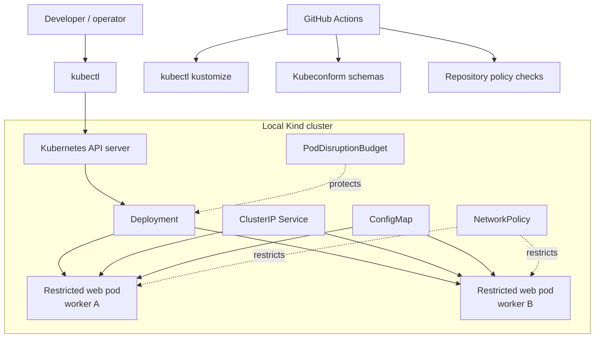

# Kubernetes Zero to Production

[](https://github.com/jeevanm84/kubernetes-zero-to-production/actions/workflows/ci.yml)
[](https://jeevanm84.github.io/kubernetes-zero-to-production/)
[](LICENSE)

A local-first Kubernetes engineering path covering workloads, networking, configuration, storage, security, observability, failure diagnosis, GitOps, and production architecture. Learners begin with static checks and Kind; AWS EKS is an optional architecture module, never an automatic deployment.

> No AWS account is required. Nothing in this repository creates cloud resources.

## Start with the master map

Use the [Kubernetes Master Map](https://jeevanm84.github.io/kubernetes-zero-to-production/) as a visual reference for architecture, kubectl, workloads, networking, storage, scaling, security, GitOps, EKS, and troubleshooting.

The map provides recall. The manifests, labs, failure injections, and operational checks provide engineering evidence.

## Platform built in the local path



## Learning paths

| Level | Modules | Demonstrable outcome |
|---|---|---|
| Beginner | 0–3 | Understand reconciliation; deploy, expose, inspect, scale, and update a workload |
| Intermediate | 4–6 | Manage configuration/storage and apply resource, identity, and network controls |
| Advanced | 7–9 | Build observability, diagnose common failures, and understand GitOps reconciliation |
| Production | 10 + scenarios | Evaluate EKS, high availability, disaster recovery, cost, policy, and incident response |

Follow the [End-to-End Guide](docs/END_TO_END_GUIDE.md) for the complete path.

## Quick offline validation

Prerequisites: Bash, Python 3, and `kubectl`. Docker and Kind are needed only when you create the optional local cluster.

```bash
git clone https://github.com/jeevanm84/kubernetes-zero-to-production.git
cd kubernetes-zero-to-production
./scripts/check.sh
```

This renders every Kustomize overlay, checks manifest structure and security policy, and runs schema validation when `kubeconform` is installed. It does not contact a Kubernetes cluster.

## Optional local cluster

```bash
./scripts/create-kind-cluster.sh
kubectl apply -k apps/web/overlays/local
kubectl -n platform-demo rollout status deployment/web
kubectl -n platform-demo port-forward service/web 8080:80
```

Open `http://localhost:8080/healthz`. When finished:

```bash
./scripts/destroy-kind-cluster.sh
```

The scripts operate only on the fixed Kind cluster name `k8s-zero-to-production`.

## Repository map

```text
kubernetes-zero-to-production/
├── apps/web/
│   ├── base/                       # Secure reusable workload
│   └── overlays/
│       ├── local/                  # Two-replica Kind profile
│       └── production-example/     # Three replicas + stricter availability
├── clusters/kind/                  # Three-node local cluster definition
├── docs/
│   ├── index.html                  # Visual master map / GitHub Pages
│   ├── END_TO_END_GUIDE.md
│   ├── ARCHITECTURE.md
│   ├── SECURITY_AND_PRODUCTION.md
│   ├── TROUBLESHOOTING.md
│   └── INTERVIEW_QUESTIONS.md
├── labs/                           # Ten progressive engineering modules
├── scripts/                        # Safe lifecycle and validation commands
├── tests/                          # Policy expectations
└── .github/                        # CI, ownership, issues and Pages
```

## Production-oriented defaults

- Namespace enforces the restricted Pod Security Standard.
- Pods run as non-root with seccomp, no privilege escalation, a read-only root filesystem, and all Linux capabilities dropped.
- Service-account token automount is disabled.
- The image is versioned and pinned to a multi-architecture digest.
- CPU/memory requests and limits are defined.
- Readiness, liveness, and startup probes have different responsibilities.
- Rolling-update settings, topology spread, and a disruption budget protect availability.
- Network policies start from deny-by-default and explicitly permit required traffic.
- Kustomize separates reusable base intent from environment-specific policy.

## Important production boundaries

Kind simulates a multi-node control surface but does not reproduce cloud load balancers, managed control-plane behavior, availability zones, IAM, managed storage, or regional failure. The production example is a design reference—not an EKS installer.

Before production use, add organization-specific ingress/TLS, external identity, policy enforcement, secret management, storage classes, backup/restore, telemetry backends, autoscaling metrics, supply-chain controls, upgrade testing, and recovery objectives.

## Documentation

- [End-to-End Guide](docs/END_TO_END_GUIDE.md)
- [Architecture](docs/ARCHITECTURE.md)
- [Security and Production Readiness](docs/SECURITY_AND_PRODUCTION.md)
- [Troubleshooting Handbook](docs/TROUBLESHOOTING.md)
- [Interview Questions](docs/INTERVIEW_QUESTIONS.md)
- [Visual Master Map](https://jeevanm84.github.io/kubernetes-zero-to-production/)

## Portfolio position

```text
Git → AWS → Terraform → Packer → Kubernetes → CI/CD → Observability → SRE
```

Prerequisite: [Git Command Master Map](https://github.com/jeevanm84/git-command-master-map). Return to the [jeevanm84 engineering portfolio](https://github.com/jeevanm84).

Maintained by [@jeevanm84](https://github.com/jeevanm84) · [MIT License](LICENSE)
