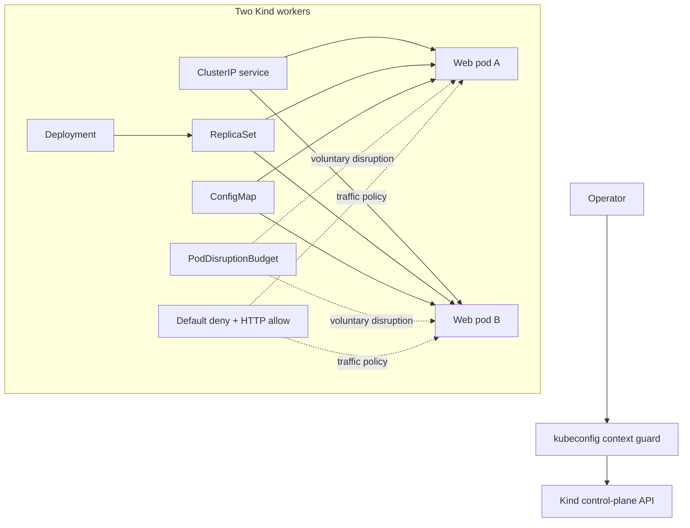
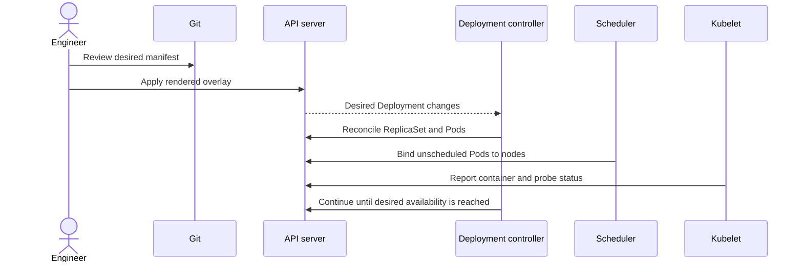
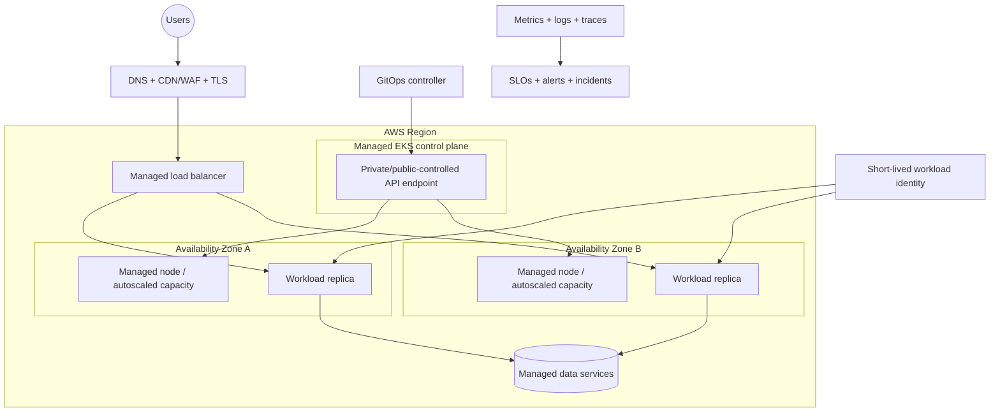

# Architecture

## Local learning platform



## Reconciliation flow



Kubernetes controllers continuously compare desired and observed state. A successful API response means the desired object was accepted; it does not mean the application is healthy.

## Configuration model

The base holds reusable security and application intent. Overlays adjust environment policy:

```text
apps/web/base
  ├── namespace and Pod Security labels
  ├── service account
  ├── configuration
  ├── deployment
  ├── service
  ├── disruption budget
  └── network policies
        │
        ├── overlays/local: two replicas
        └── overlays/production-example: three replicas, minAvailable two
```

The production example deliberately remains incomplete because DNS, certificates, ingress, identity, storage, observability, and policy depend on the target platform and organization.

## Availability boundaries

| Mechanism | Protects against | Does not protect against |
|---|---|---|
| Two or three replicas | One container/Pod loss | Shared application dependency failure |
| Topology spread | Concentrating replicas on one hostname | Regional or control-plane failure |
| Readiness probe | Sending traffic to an unready container | Incorrect business results |
| Liveness probe | Some stuck-process conditions | External dependency failure without careful design |
| Disruption budget | Excess voluntary eviction | Node crash or hard infrastructure failure |
| Rolling update | Planned version replacement | An invalid new version without rollback criteria |

## Production EKS reference



This diagram is a review checklist, not a deployable promise.
